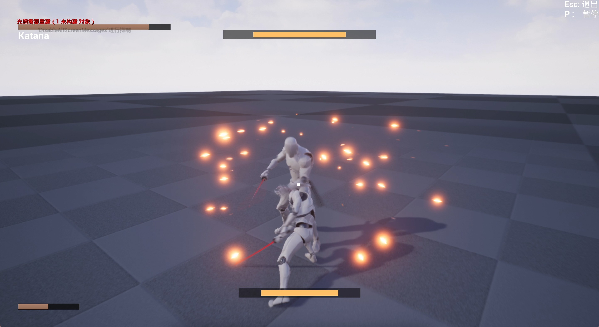
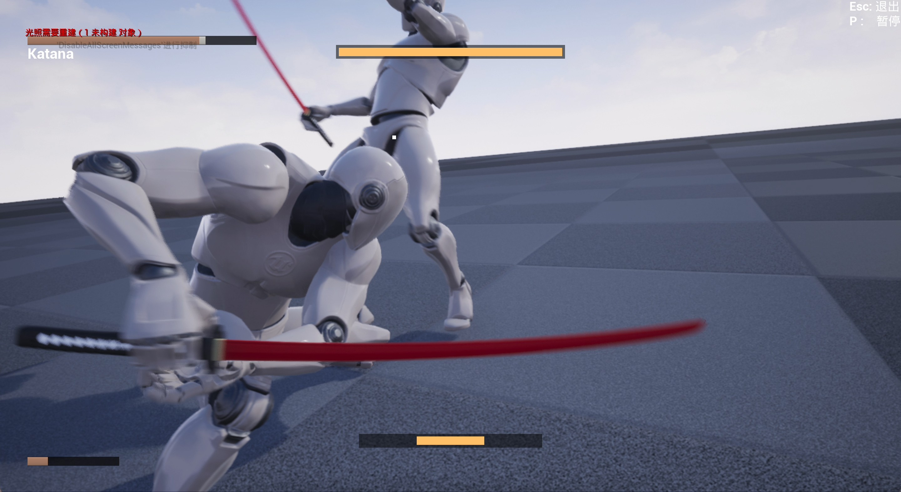
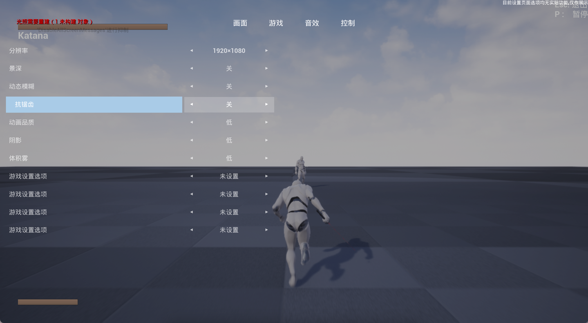
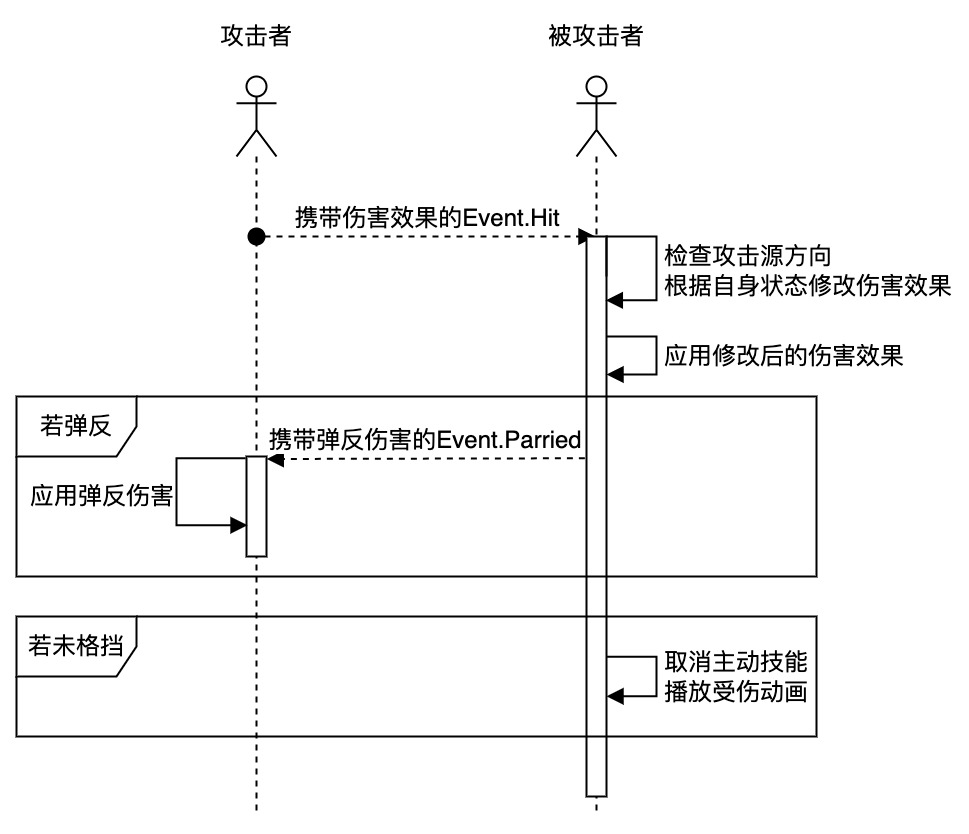

# SekiroLike

SekiroLike是一个仿照《只狼》战斗系统的动作游戏Demo。SekiroLike使用Unreal Engine 4.27制作，使用Gameplay Ability System插件实现主要游戏逻辑。

[项目地址](https://github.com/storyoftime66/SekiroLike)

按键 | 操作
---|---
W、A、S、D  |   角色移动
鼠标左键    |   攻击
鼠标右键    |   格挡
左Shift     |   垫步
鼠标中键、F |   锁定敌人
鼠标滚轮    |   切换锁定目标
P   |  设置菜单（仅UI界面，无功能）
Esc |   退出游戏

---

## 战斗系统介绍

### 角色属性与角色技能

玩家角色和敌人有四个主要属性：生命值、躯干值、攻击力、防御力。
- 生命值为零时，玩家角色会直接阵亡，而敌人角色再次受到伤害后会直接进入可处决状态，玩家进行处决后敌人才会阵亡。
- 躯干值积累到最大时，玩家角色会进入破体状态，会在短时间内无法行动并且受到伤害增加；敌人角色在躯干值满时进入可处决状态，此时玩家在此按下攻击键可进行处决。
- 攻击力影响角色对对手造成的生命伤害；防御力会削减受到的生命伤害。

玩家角色拥有攻击、蓄力攻击、格挡、垫步四个主动技能。
- 攻击包含多段斩击，每段攻击有独特的动画。短时间内若未连续进行攻击则会重置连击段数。
- 长按攻击键可以释放蓄力攻击，蓄力攻击为中距离的突刺攻击。
- 格挡可以使角色免疫来自前方的生命伤害，并小幅削减受到的躯干伤害。在适当时机使用格挡会使受到的躯干伤害大幅降低并对攻击者造成一定比例的躯干伤害。格挡技能也可以长按来持续抵挡前方的攻击。
- 垫步可以快速改变身位，并在释放瞬间有短暂的无敌效果。使用垫步时若有移动输入，则会朝向移动输入方向释放。

敌人角色技能包括攻击、战技、格挡。
- 敌人攻击包括多段，可以被强冲击力的攻击打断。
- 战技在施放时会赋予敌人角色霸体效果，不会被打断。
- 敌人角色也会格挡和弹反玩家的攻击。

### 技能设定

主动技能通常分为四个阶段，前摇阶段、生效开始阶段、生效结束阶段、后摇阶段。
  - 前摇阶段为技能的起手动画，此时若释放其他技能则可以取消当前技能。例如：在攻击前摇时使用格挡，会取消攻击直接释放格挡技能。
  - 生效开始阶段通常为技能选取目标的阶段，生效结束阶段无特殊效果。玩家在生效开始阶段和生效结束阶段不能使用其他主动技能。
  - 后摇阶段为技能的收手动画，此时玩家已经可以使用其他主动技能或进行移动。

攻击技能有冲击力设定，冲击力分为弱冲击和强冲击，弱攻击无法打断敌人招式，只会使被攻击部位抖动一下，强攻击可以打断敌人角色的一些招式。

技能连放机制：在一个技能生效时，尝试使用另一个技能，会在当前技能结束后自动使用下一个技能。例如，在攻击时，按下格挡键，在攻击结束后会自动进行一次格挡。

### 其他功能

1. 锁定敌人，锁定时视角会一直朝向该敌人。
   - 敌人死亡或距离过远时自动取消锁定。
   - 滚动鼠标可以切换锁定目标。

2. 设置页面，主要包含两个类型的控件：单选设置项和拾键设置项。目前设置页面暂无实际功能。

## 战斗系统实现原理

## 已知问题
1. 敌人破体时，玩家角色出现异常转动。
2. 敌人躯干值不为0时，躯干条也会消失。
3. 玩家主动技能被打断后，有概率导致主动技能无法施放。4
4. 格挡技能配合技能连放机制会有问题，格挡技能不会自动取消。

## 注意事项
此项目在Mac上编写，源文件编码为默认的utf-8，行尾默认为`LF`。若在Windows上编译需要使用git的自动修改行尾功能：
`git config core.autocrlf`，配置好后使用git拉取时会自动将行尾修改为`CRLF`。
然后使用下面的工具将Source和Plugins文件夹转换成`utf-8 with BOM`编码。  [编码转换工具](https://github.com/rexcape/code-transmit/blob/master/exe/codeTransmit.exe)

或可直接下载：[Windows项目文件](https://github.com/storyoftime66/SekiroLike/releases/tag/v0.1)